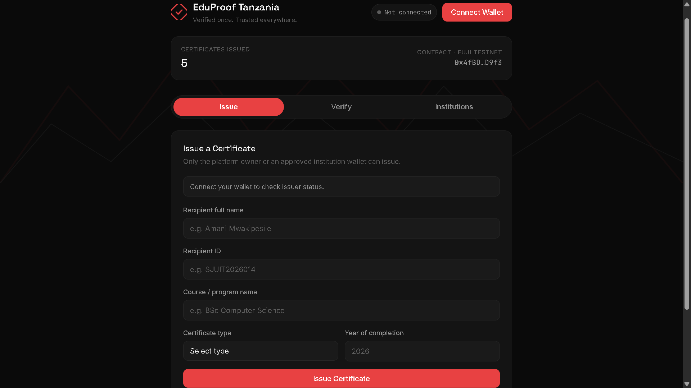

# EduProof Tanzania — Blockchain Certificate Verification

A blockchain-based certificate verification system built on Avalanche, created for the SJUIT × Avalanche Blockchain Workshop 2026 Hackathon.

---

## Problem Statement

Verifying academic and training certificates in Tanzania is slow and easy to forge. Employers and institutions have no fast, reliable way to confirm a certificate is genuine — verification usually means manually contacting the issuing institution, which can take days or never get a response at all. That gap lets fake certificates slip through, and it costs honest graduates time and credibility every time they need to prove a qualification.

## Solution Overview

EduProof Tanzania lets approved institutions — universities, bootcamps, hackathon organizers, and training programs — issue certificates directly onto the Avalanche Fuji Testnet. Each certificate is permanently and tamper-proof recorded on-chain, tied to a unique Recipient ID. Anyone — an employer, another institution, or the certificate holder — can verify a certificate instantly by entering that ID. No account, no wallet, no technical knowledge required to check one.

## Track Selected

`Education & Credentials`

## Features

- On-chain certificate issuance, restricted to approved institution wallets
- Multi-institution support — any approved Tanzanian institution can issue under its own name
- Public verification with no wallet or account needed
- Four certificate types: Degree, Bootcamp, Hackathon, Training
- Owner-controlled institution approval and certificate revocation
- Clean, dark-themed single-page interface with no build step and no framework

## Tech Stack

- **Solidity ^0.8.0** — smart contract
- **Avalanche Fuji Testnet** (C-Chain, Chain ID 43113)
- **Remix IDE** — contract development and deployment
- **Core Wallet** — signing transactions
- **ethers.js v5.7.2** — frontend ↔ blockchain connection
- **HTML / CSS / vanilla JavaScript** — frontend, no framework

## Smart Contract

- **Address:** `0x4fBD4226A537f63b0d968Aea48fe219D7448D9f3`
- **Network:** Avalanche Fuji Testnet (Chain ID 43113)
- **Explorer:** [View on Snowtrace](https://testnet.snowtrace.io/address/0x4fBD4226A537f63b0d968Aea48fe219D7448D9f3)

This is the third iteration of the contract. Earlier versions (`SJUITCertChain`, `SJUITCertificateV3`) proved the core idea for a single university before this version generalized it so any approved Tanzanian institution can issue under its own name.

## How to Run Locally

1. Clone this repository.
2. Open `EduProofTanzania.html` directly in a browser, or open the folder in VS Code and run it with the **Live Server** extension.
3. Install the [Core Wallet](https://core.app/) or MetaMask browser extension.
4. Connect your wallet — the app will prompt you to switch to or add Avalanche Fuji Testnet automatically.
5. Get free testnet AVAX from the [Avalanche Fuji Faucet](https://core.app/tools/testnet-faucet/) to pay for transactions.
6. Use the **Verify** tab to check a certificate (no wallet needed), or the **Issue** tab to create one (requires an approved wallet).

## Screenshots / Demo

1. [landing page!](landingpage.png)
2. [Wallet connected!](<Wallet connected.png>)
3. [Issue form filled in!](<Issue form filled in.png>)
4. [Successful issuance confirmation!](<Successful issuance confirmation.png>)
5. [Verify result — real certificate!](<Verify result — real certificate.png>)
6. [Verify result — fake / not-found ID!](<Verify result — fake-not-found ID.png>)

## Team Members

Submitted individually by `Godwin Shirima` (@fyne__tech) — SJUIT, Dar es Salaam, Tanzania.

## Future Improvements

- Move from testnet to Avalanche mainnet or a dedicated Avalanche L1 for production use
- Pursue official recognition through TCU (Tanzania Commission for Universities)
- Add an in-app revoke action for admins directly from the verify screen
- Add offline-friendly verification for low-connectivity areas
- Onboard additional institutions beyond SJUIT — other universities, bootcamps, and eventually the wider East African Community
